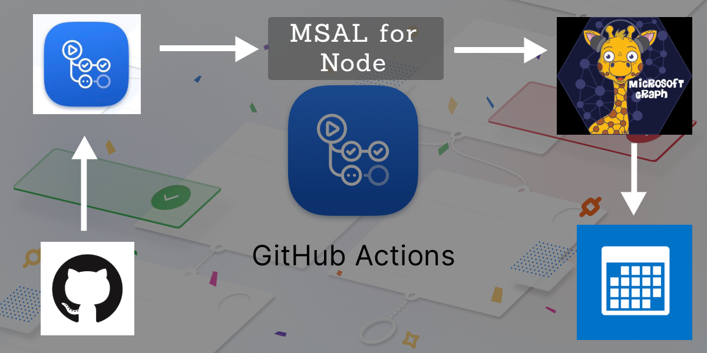
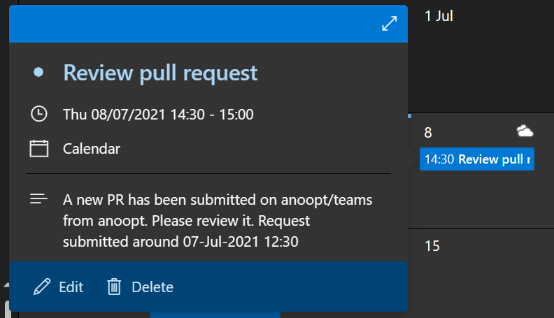

# GitHub Action to create event with Microsoft Graph using MSAL

This action creates an event in a user's Outlook calendar. This action can be used when say for example a pull request is created and some one has to review it. The event that gets created will have some details about the pull request.

## What it does



## Pre requisites

This action uses Microsoft Graph to create an event. So please make sure that you [register an application in Azure AD](https://docs.microsoft.com/en-us/graph/auth-register-app-v2), provide that app `Calendars.ReadWrite` permissions and create a client secret for that.

In your GitHub repo [create 3 secrets](https://help.github.com/en/actions/automating-your-workflow-with-github-actions/creating-and-using-encrypted-secrets) with the following information:

* CLIENT_ID - The Id of the app registration created above
* CLIENT_SECRET - A secret of the app registration created above.
* TENANT_ID - The Id of your Microsoft 365 tenant


## Usage

Below is a workflow code

```workflow
name: MS Graph Event

on: [pull_request]

jobs:
  create-event:
    runs-on: ubuntu-latest
    name: Create Event
    steps:
    - name: Create event on the next day
      uses: anoopt/ms-graph-create-event-msal@v1
      with:
        clientId: ${{ secrets.CLIENT_ID }}
        clientSecret: ${{ secrets.CLIENT_SECRET }}
        tenantId: ${{ secrets.TENANT_ID }}
        subject: 'Review pull request'
        body: 'A new PR has been submitted on ${{ github.repository }} from ${{ github.actor }}. Please review it.'
        userEmail: 'user@contoso.onmicrosoft.com'
```

When there is a pull request, the above workflow will create an event for user 'user@contoso.onmicrosoft.com' on the next day from 12:00 to 13:00 (automatic as no start or end is specified).  

## More Information

All of the information attached to an event is available in the `github.event` variable. To see the possible values, you can use the following step in your workflow:

```yaml
- run: echo '${{ toJson(github.event) }}'
```

```workflow
name: MS Graph Event

on: [push]

jobs:
  create-event:
    runs-on: ubuntu-latest
    name: Create Event
    steps:
    - name: Checkout
      uses: actions/checkout@v1
    - name: Create event on the specified day and time
      uses: anoopt/ms-graph-create-event-msal@v1
      with:
        clientId: ${{ secrets.CLIENT_ID }}
        clientSecret: ${{ secrets.CLIENT_SECRET }}
        tenantId: ${{ secrets.TENANT_ID }}
        subject: 'Code pushed'
        body: 'Some files have been pushed on ${{ github.repository }} from ${{ github.actor }}. Please find the details here ${{ github.event.compare }}.'
        userEmail: 'user@contoso.onmicrosoft.com'
        start: '2019-12-04T14:30:00'
        end: '2019-12-04T15:00:00'
```

When there is a code push, the above workflow will create an event for user 'user@contoso.onmicrosoft.com' on 4th Dec 2019 from 14:30 to 15:00 with the URL of compare in details.

## Event that gets created

